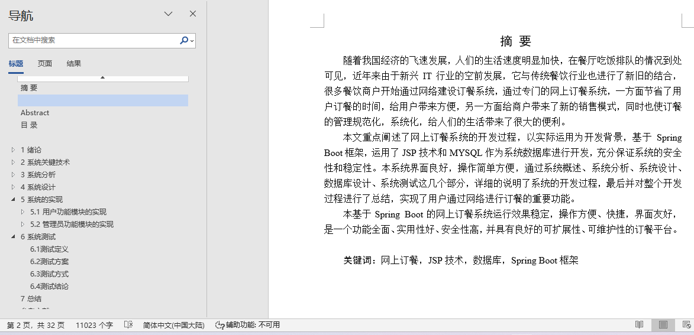
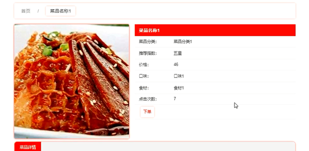
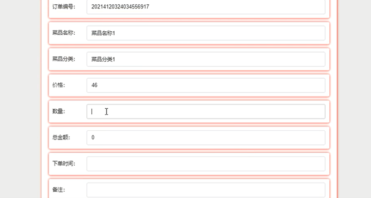
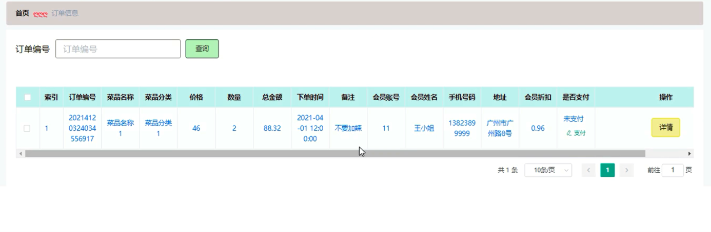
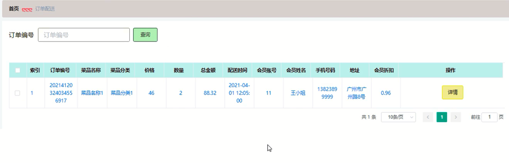
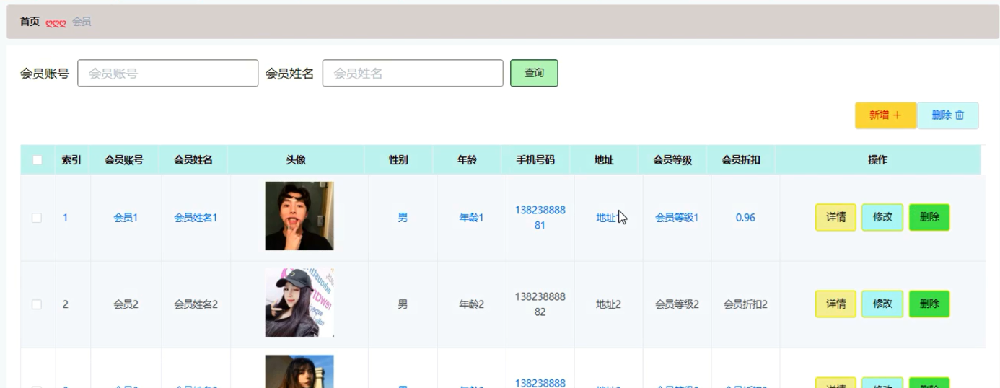
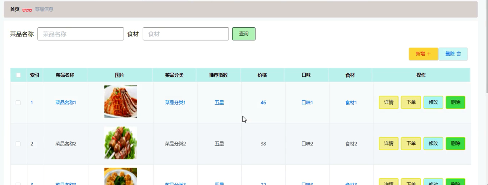
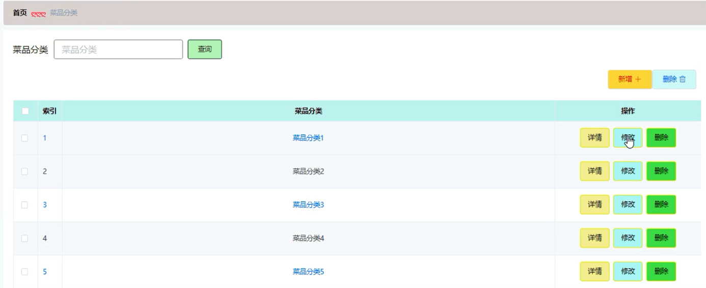

## 基于SpringBoot的网上订餐系统(程序+报告)

###  获取sql数据库文件: 从戎源码网 (https://armycodes.com/) QQ: 386869957 QQ群: 377586148
###  所有系统地址: (https://github.com/YuLin-Coder/AllProjectCatalog) 
###  所有项目以及源代码本人均调试运行无问题 可支持远程安装部署调试、定制修改、代码讲解

## 项目介绍
基于SpringBoot的网上订餐系统，系统包含两种角色：用户、管理员，系统分为前台和后台两大模块，主要功能如下：

### 【管理员】:
管理员登录: 管理员通过后台登录界面进入系统进行管理操作。
会员管理: 管理员可以查看、添加、修改和删除会员信息。
菜品信息管理: 管理员可以添加、修改和删除菜品信息。
菜品分类管理: 管理员可以增删改查菜品分类信息。
订单信息管理: 管理员可以查看所有订单信息，并进行安排配送、修改和删除操作。
订单配送管理: 管理员可以增删改查订单配送信息。

### 【用户】:
统登录: 用户通过用户名和密码登录系统。
用户注册: 未注册用户可以进行注册操作。
菜品详情: 用户可以查看菜品详情信息，并在登录后进行下单操作。
下单订餐: 用户登录后可以选择菜品进行下单订餐操作。
订单信息: 用户可以查看和支付订单。
订单配送: 用户可以查看个人订单的配送信息。

## 项目技术
- 编程语言：Java
- 数据库：MySQL
- 项目管理工具：Maven
- 前端技术：HTML、CSS、JavaScript、Jquery、Vue
- 后端技术：Spring、SpringMVC、MyBatis

## 运行环境
- JDK版本：JDK1.8及以上
- 开发工具：IDEA、Ecplise、Myecplise都可以
- 数据库: MySQL5.7及以上
- Maven：maven3.0及以上
- Node：14.14.0及以上

## 运行截图

